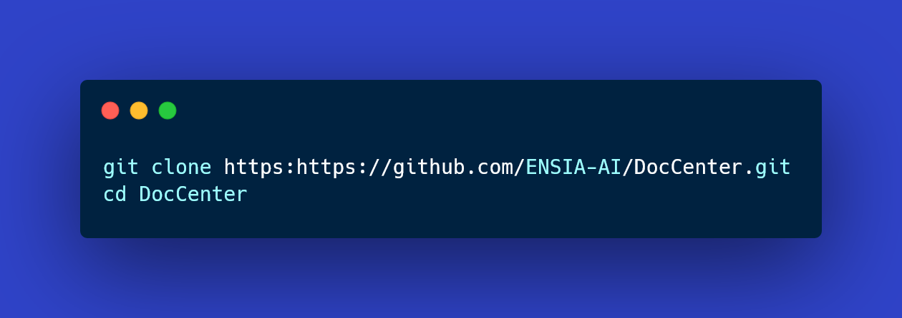
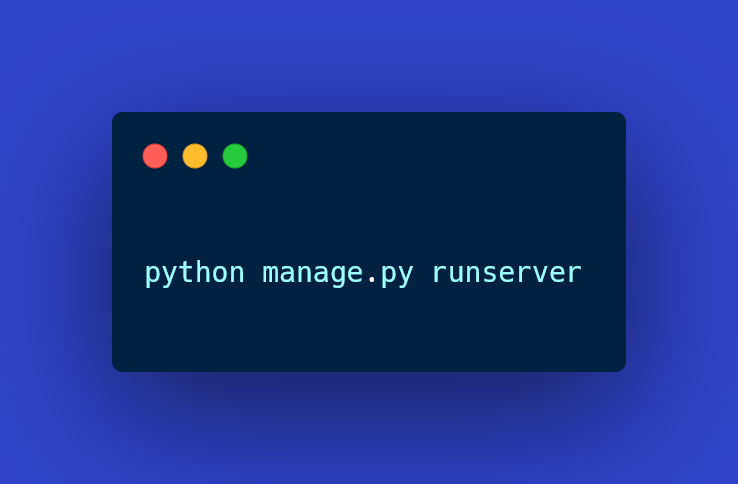
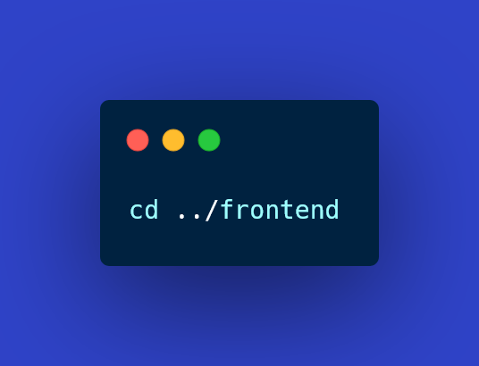
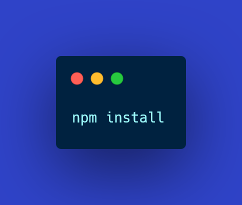

 

[Home](#-doccenter) • [Overview](#-Overview) • [Tech-Stack](#-tech-stack) • [Setup](#-Setup) • [License](#-License)

# 🩺 DOCCENTER

**DOCCENTER** is a publishing platform designed exclusively for doctors and medical researchers to share their latest work.

---

## 🚀 Overview
DOCCENTER provides a simple and reliable space where verified doctors can:
- Publish medical articles and research papers.  
- Build their professional profiles and share expertise.
- Discover and read research from other medical professionals.
- Interact through comments, ratings, and peer feedback.

---

## 🧱 Tech Stack
- **Backend:** Django 4.2 (REST Framework)
- **Frontend:** React + TailwindCSS
- **Database:** PostgreSQL
- **Deployment:** Render / Vercel

---

## ⚙️ Setup (Development)
- **1. Clone the Repository**

- **2. Backend Setup (Django + DRF)**
- Step 2.1: Create and activate a virtual environment

- Step 2.2: Install backend dependencies

- Step 2.3: Apply migrations

- Step 2.4: Create superuser (optional)

- Access admin panel at **http://localhost:8000/admin/**
- Step 2.5: Run the backend server

- Access the app at **http://localhost:8000/**
- **3. Frontend Setup (React + Tailwind 3.1.14 + daisyUI)**
- Step 3.1: Navigate to frontend

- Step 3.2: Install dependencies

- Step 3.3: Run the frontend

- **4. Configuration Notes**
- Backend
Ensure CORS is configured in backend/settings.py:

- Frontend
API base URL is set in frontend/src/api.js:

Update if your backend runs on a different host or port.

**5. Development Tips**

Keep frontend and backend running in separate terminal windows.

Node.js (v16+) and Python (v3.10+) are required.

Tailwind + daisyUI works out-of-the-box using tailwind.config.js.

## Theme

-Primary Color : #2f43c8
-Secondary Color : #d44bb7
## 📄 License