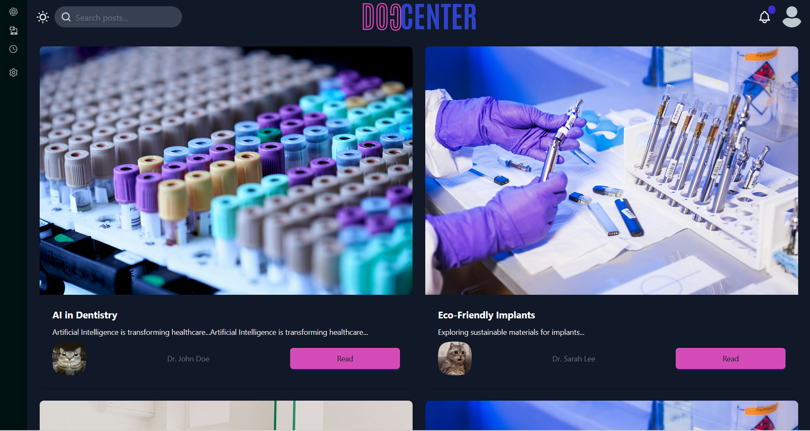
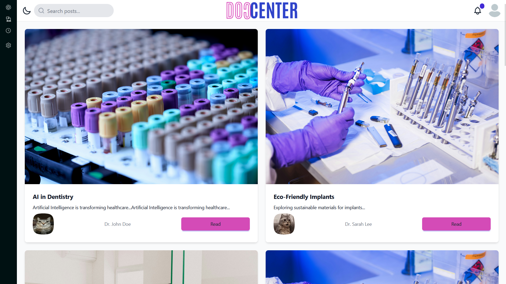
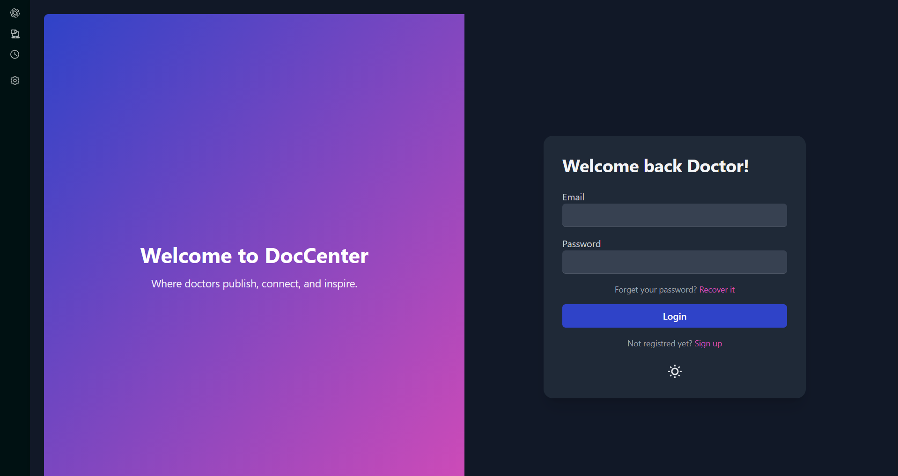
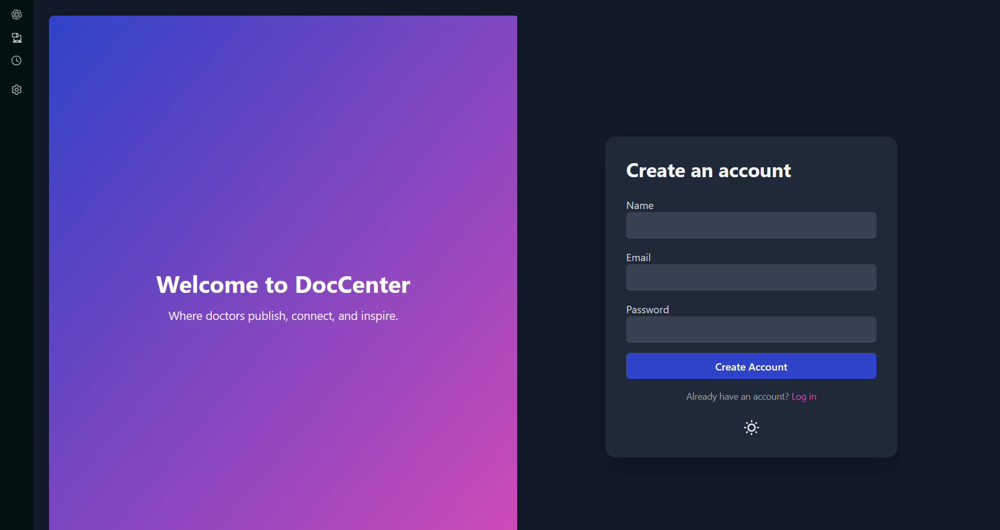
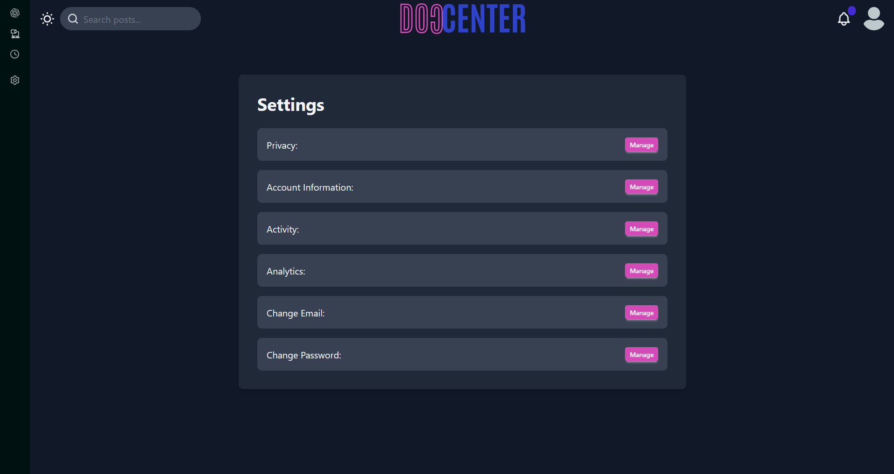
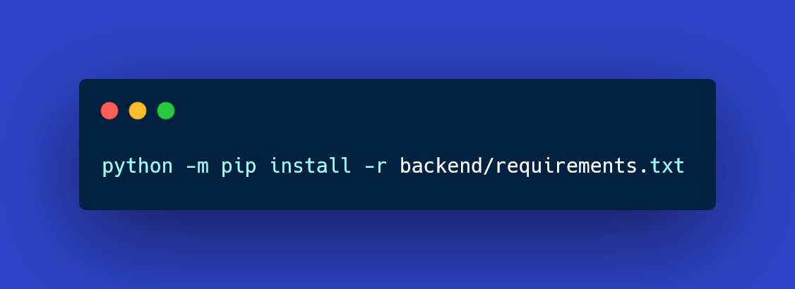
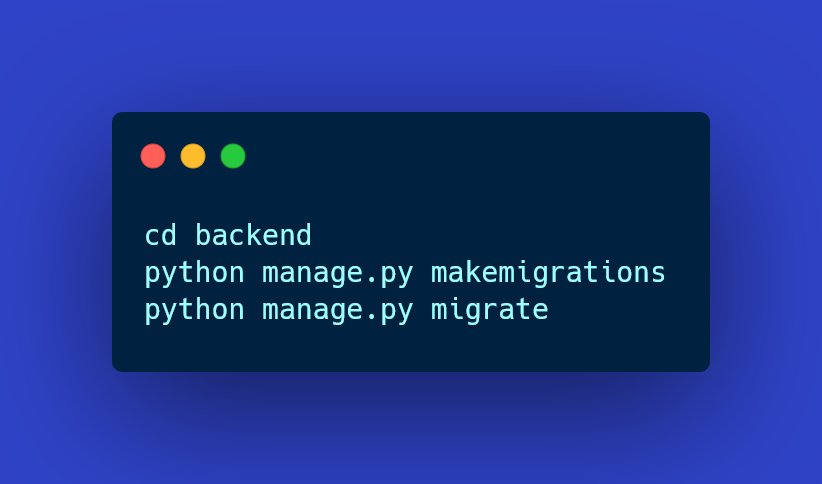
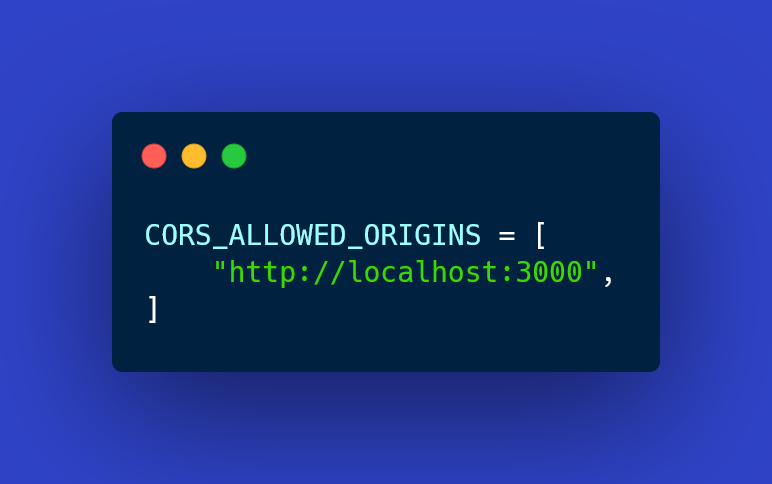

## GOALS (This section is temporary and may be removed.)

Making the goals public allows instructors to easily monitor progress. Dr. Sami Abdelatif and Dr. Mahmoudi have full access to this section and are authorized to review it, providing guidance, recommendations, and instructions based on their expertise and professional judgment.

**Project Interface Status:**
The interface is almost ready to be shipped, including the following fully implemented features:

- Login / Signup
- Home
- Settings
- Notifications
- About Us
- Contact
- Light / Dark Theme

**Upcoming Tasks:**
- The following functionalities still need to be implemented soon:
- Search Bar functionality
- Profile and saved posts
- Password change and general settings functionality

**Pending / Untouched Areas:**
- The following components are yet to be developed:
- Backend
- API
- Models & Database

**Important Notes (Please Read!)**
All of the texts have been handwritten; AI and LLMs were only fairly & lightly utilized during the development phase mostly to search and navigate documentations and frameworks tags/methods.

 

[Home](#-doccenter) • [Overview](#-Overview) • [Tech-Stack](#-tech-stack) • [Setup](#-Setup) • [License](#-License)

# 🩺 DOCCENTER

**DOCCENTER** is a publishing platform designed exclusively for doctors and medical researchers to share their latest work.

---

## 🚀 Overview
DOCCENTER provides a simple and reliable space where verified doctors can:
- Publish medical articles and research papers.  
- Build their professional profiles and share expertise.
- Discover and read research from other medical professionals.
- Interact through comments, ratings, and peer feedback.

---
# **Showcasing the platform**

## **Home Page**

## **Light Theme**

## **Notifications Center**

## **Login**

## **Register**

## **settings**

---

## 🧱 Tech Stack
- **Backend:** Django 4.2 (REST Framework)
- **Frontend:** React + TailwindCSS
- **Database:** PostgreSQL
- **Deployment:** Render / Vercel

---

## ⚙️ Setup (Development)
- **1. Clone the Repository**

- **2. Backend Setup (Django + DRF)**
- Step 2.1: Create and activate a virtual environment

- Step 2.2: Install backend dependencies

- Step 2.3: Apply migrations

- Step 2.4: Create superuser (optional)

- Access admin panel at **http://localhost:8000/admin/**
- Step 2.5: Run the backend server

- Access the app at **http://localhost:8000/**
- **3. Frontend Setup (React + Tailwind 3.1.14 + daisyUI)**
- Step 3.1: Navigate to frontend

- Step 3.2: Install dependencies

- Step 3.3: Run the frontend

- **4. Configuration Notes**
- Backend
Ensure CORS is configured in backend/settings.py:

- Frontend
API base URL is set in frontend/src/api.js:

Update if your backend runs on a different host or port.

**5. Development Tips**

Keep frontend and backend running in separate terminal windows.

Node.js (v16+) and Python (v3.10+) are required.

Tailwind + daisyUI works out-of-the-box using tailwind.config.js.

## Theme

-Primary Color : #2f43c8
-Secondary Color : #d44bb7

## 📄 License