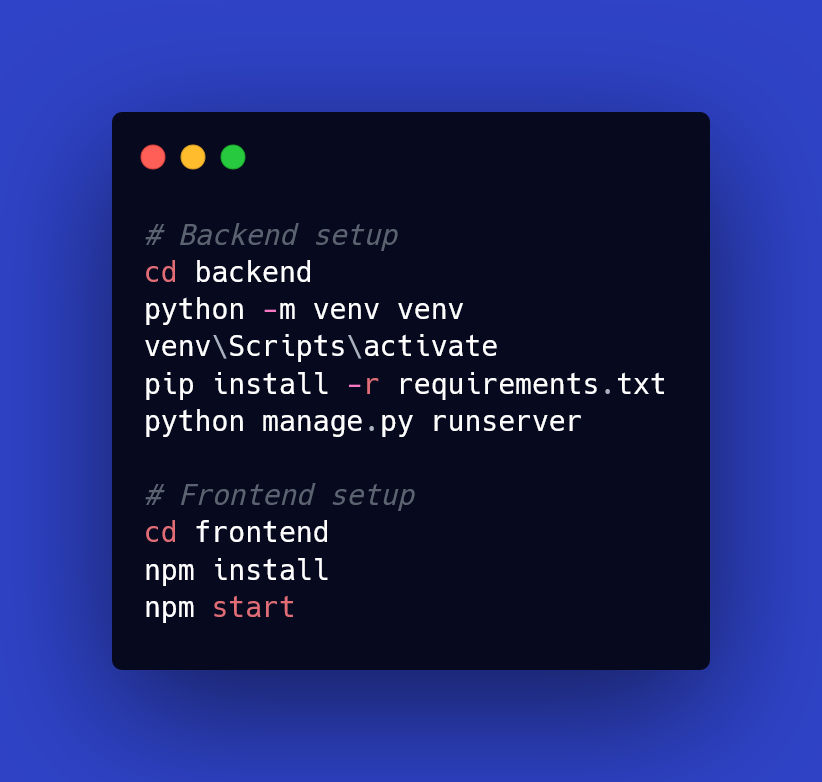

 

[Home](#-doccenter) • [Overview](#-Overview) • [Tech-Stack](#-tech-stack) • [Setup](#-Setup) • [License](#-License)

# 🩺 DOCCENTER

**DOCCENTER** is a publishing platform designed exclusively for doctors and medical researchers to share their latest work.

---

## 🚀 Overview
DOCCENTER provides a simple and reliable space where verified doctors can:
- Publish medical articles and research papers.  
- Build their professional profiles and share expertise.
- Discover and read research from other medical professionals.
- Interact through comments, ratings, and peer feedback.

---

## 🧱 Tech Stack
- **Backend:** Django 4.2 (REST Framework)
- **Frontend:** React + TailwindCSS
- **Database:** PostgreSQL
- **Deployment:** Render / Vercel

---

## ⚙️ Setup (Development)

## 📄 License